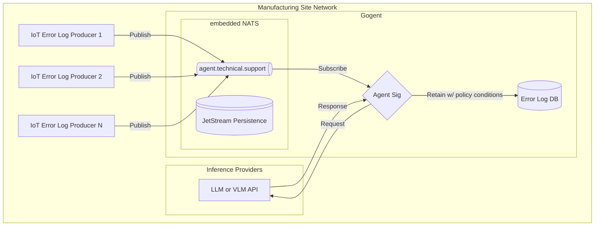

# Gogent - Agentic Worker AI in Golang

Gogent is a distributed log analysis system that uses embedded NATS messaging and LLM-powered agents to process and analyze system logs in real-time and at the edge.

The motivation to do this was:
1. Explore AI agents in purely Go and not use Python
2. How this could be lightweight and usable in the Reindustrialization of America.
3. Focus on the use-case of having error log data collection to simplify analysis, collection, and aggregation of all system errors on a manufacturing site into a DB which can then be used for analyzing patterns of errors, metadata analysis to help Operators diagnose and resolve production issues faster, ultimately increasing reindustrializtion and manufacturing productivity.

***TODO:*** 
**- Embed tools for agent common in IT and manufacturing support, such as: servicenow, jira, splunk, palantir foundry, etc.**
**- Explore scalable optimization points by using TF-IDF, LSH, Word2Vec as part of a worker pipeline.**

### Limitations
- Nil pointer if agent is overloaded with messages > 20
- Ollama on non-GPU accelerated machines and ample VRAM unable to handle the concurrent requests from Gogent


## Architecture



## Core Components

- **Embedded NATS Server**: Handles message queuing and distribution
- **Agent Service**: Processes messages using LLM
- **Multi-Provider LLM Support**:
  - Ollama (default, with deepkseek-r1:1.5b)
  - OpenAI
  - Azure OpenAI
  - Azure AD
  - Cloudflare Azure
  - Gemini
  - Claude (Anthropic)
  - DeepSeek
- **JetStream**: Persistent message storage
- **SQLite Database**: Stores structured logs and AI analysis for historical querying

## Message Flow

1. Log messages are published to `agent.technical.support` subject
2. Agent subscribes to messages and formats them for LLM processing
3. Selected LLM provider analyzes the log content
4. Analysis results are sent back through NATS if reply subject exists
5. Messages are persisted in `AGENT_STREAM` with `AGENT_CONSUMER` subscription
6. Both original logs and AI analysis are stored in SQLite database

## Technical Details

### Agent Configuration

```go
type Config struct {
    APIKey       string    // Required for non-Ollama providers
    NATSUrl      string
    AgentName    string
    Instructions string
    Model        string
    Provider     string    // LLM provider selection
    DBPath       string    // Path to SQLite database
}
```

### Default Configuration
```go
// NATS Configuration
StreamName    = "AGENT_STREAM"
ConsumerName  = "AGENT_CONSUMER"
SubjectName   = "agent.technical.support"
NATSPort      = 4222
NATSURL       = "nats://localhost:4222"

// Agent Configuration
AgentName = "Agent Sig"
Provider  = "OLLAMA"     // Default provider
Model     = "deepseek-r1:1.5b"    // Default model
```

### Message Structure
```go
type LogMessage struct {
    Timestamp string
    Hostname  string
    Severity  string
    Service   string
    Message   string
    Context   map[string]interface{}
}
```

### Database Schema
```sql
CREATE TABLE agent_logs (
    id INTEGER PRIMARY KEY AUTOINCREMENT,
    timestamp TEXT NOT NULL,
    hostname TEXT NOT NULL,
    severity TEXT NOT NULL,
    service TEXT NOT NULL,
    message TEXT NOT NULL,
    context TEXT,           -- JSON string of context map
    analysis TEXT,          -- AI-generated analysis
    created_at DATETIME DEFAULT CURRENT_TIMESTAMP
);
```

## Setup

### Prerequisites

- Go 1.23.4 or later
- Git
- SQLite3
- Docker and Docker Compose (for containerized setup)
- For non-Ollama providers, one of:
  - OpenAI API key
  - Azure OpenAI credentials
  - Azure AD credentials
  - Cloudflare Azure setup
  - Gemini API key
  - Claude API key
  - DeepSeek API key

### Installation

1. Clone the repository:
```bash
git clone https://github.com/tobalo/gogent.git
cd gogent
```

2. Install dependencies:
```bash
go mod download
```

3. Create environment file:
```bash
cp .env.example .env
```

4. Configure your .env file:
```sh
# LLM Provider Configuration
PROVIDER=OLLAMA    # See .env.example for all provider options
MODEL=deepseek-r1:1.5b     # Model name for selected provider
API_KEY=your_key  # Required for non-Ollama providers

# Other configurations...
```

### Running with Docker Compose

The easiest way to run Gogent is using Docker Compose, which sets up both Gogent and Ollama in a software-defined network:

1. Start the services:
```bash
docker-compose up -d
```

This will:
- Start Ollama service (if using Ollama provider)
- Pull the deepseek-r1:1.5b model automatically (for Ollama)
- Start Gogent with the configured provider
- Set up a bridge network between services
- Configure persistent storage for both services

2. Monitor the logs:
```bash
docker-compose logs -f
```

3. Stop the services:
```bash
docker-compose down
```

### Running Locally

If you prefer to run without Docker:

1. Start the agent:
```bash
go run cmd/microlith/main.go
```

2. The agent will initialize with:
   - Embedded NATS server on port 4222
   - JetStream enabled for message persistence
   - Agent subscribed to agent.technical.support
   - 30-second timeout for LLM processing
   - SQLite database in data/agent.db

## Sample Usage

### Publishing Messages

Messages can be published using the NATS CLI:

```bash
nats pub agent.technical.support '{
    "timestamp": "2025-01-15T02:14:23.123Z",
    "hostname": "web-server-01",
    "severity": "ERROR",
    "service": "nginx",
    "message": "Failed to bind to port 80: Address already in use",
    "context": {
        "pid": 1234,
        "user": "www-data"
    }
}'
```

### Querying Logs

You can query the stored logs using SQLite:

```bash
sqlite3 data/agent.db "SELECT timestamp, severity, message, analysis FROM agent_logs WHERE severity = 'ERROR' ORDER BY timestamp DESC LIMIT 5;"
```

## Features

- Real-time log processing
- Comprehensive multi-provider LLM support
- Edge AI capability with Ollama
- Cloud provider support (Azure, OpenAI, etc.)
- Distributed message handling
- Persistent message storage via JetStream
- Structured log storage in SQLite database
- Historical log querying capabilities
- Configurable agent behavior
- Automatic message formatting for LLM processing
- Response handling with original context
- Docker Compose support for easy deployment
