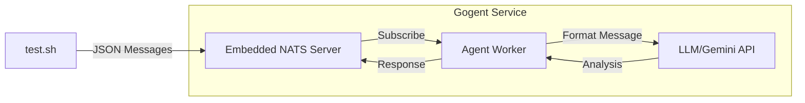

# Gogent - Agentic Worker AI in Golang

Gogent is a distributed log analysis system that uses embedded NATS messaging and LLM-powered agents to process and analyze system logs in real-time.

## Architecture



## Core Components

- **Embedded NATS Server**: Handles message queuing and distribution
- **Agent Service**: Processes messages using LLM
- **Gemini Integration**: Provides AI-powered log analysis
- **JetStream**: Persistent message storage

## Message Flow

1. Log messages are published to `AGENT.TECHNICAL.SUPPORT` subject
2. Agent subscribes to messages and formats them for LLM processing
3. Gemini API analyzes the log content
4. Analysis results are sent back through NATS if reply subject exists

## Technical Details

### Agent Configuration

```go
type Config struct {
    GeminiAPIKey string
    NATSUrl      string
    AgentName    string
    Instructions string
    Model        string
}
```

### Message Structure

```go
type LogMessage struct {
    Timestamp string
    Hostname  string
    Severity  string
    Service   string
    Message   string
    Context   map[string]interface{}
}
```

## Sample Usage

Test messages can be published using:

```bash
nats pub AGENT.TECHNICAL.SUPPORT '{
    "timestamp": "2025-01-15T02:14:23.123Z",
    "hostname": "web-server-01",
    "severity": "ERROR",
    "service": "nginx",
    "message": "Failed to bind to port 80: Address already in use",
    "context": {
        "pid": 1234,
        "user": "www-data"
    }
}'
```

## Features

- Real-time log processing
- AI-powered log analysis
- Distributed message handling
- Persistent message storage via JetStream
- Configurable agent behavior
- Automatic message formatting for LLM processing
- Response handling with original context