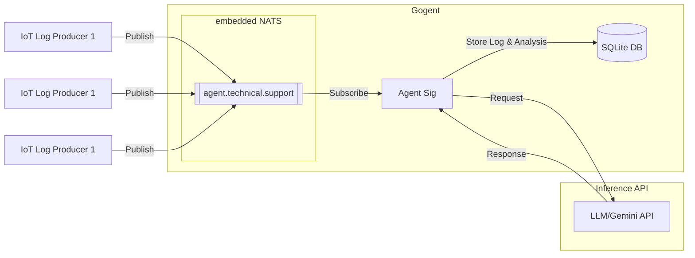

# Gogent - Agentic Worker AI in Golang

Gogent is a distributed log analysis system that uses embedded NATS messaging and LLM-powered agents to process and analyze system logs in real-time and at the edge.

The motivation to do this was:
1. Explore AI agents in purely Go and not use Python
2. How this could be lightweight and usable in the Reindustrialization of America.
3. Focus on the use-case of having error log data collection to simplify analysis, collection, and aggregation of all system errors on a manufacturing site into a DB which can then be used for analyzing patterns of errors, metadata analysis to help Operators diagnose and resolve production issues faster, ultimately increasing reindustrializtion and manufacturing productivity.

## Architecture



## Core Components

- **Embedded NATS Server**: Handles message queuing and distribution
- **Agent Service**: Processes messages using LLM
- **Gemini Integration**: Provides AI-powered log analysis
- **JetStream**: Persistent message storage
- **SQLite Database**: Stores structured logs and AI analysis for historical querying

## Message Flow

1. Log messages are published to `agent.technical.support` subject
2. Agent subscribes to messages and formats them for LLM processing
3. Gemini API analyzes the log content using gemini-1.5-flash-8b model
4. Analysis results are sent back through NATS if reply subject exists
5. Messages are persisted in `AGENT_STREAM` with `AGENT_CONSUMER` subscription
6. Both original logs and AI analysis are stored in SQLite database

## Technical Details

### Agent Configuration

```go
type Config struct {
    GeminiAPIKey string
    NATSUrl      string
    AgentName    string
    Instructions string
    Model        string
    DBPath       string    // Path to SQLite database
}
```

### Default Configuration
```go
// NATS Configuration
StreamName    = "AGENT_STREAM"
ConsumerName  = "AGENT_CONSUMER"
SubjectName   = "agent.technical.support"
DefaultNATSPort = 4222
DefaultNATSURL  = "nats://localhost:4222"

// Agent Configuration
DefaultAgentName = "Agent Sig"
DefaultAgentModel = "gemini-1.5-flash-8b"
DefaultAgentInstructions = "You are a technical analyst that executes natural language reporting from technical information and raw SIGINT data. Analyze system logs and provide concise, actionable insights."
```

### Message Structure
```go
type LogMessage struct {
    Timestamp string
    Hostname  string
    Severity  string
    Service   string
    Message   string
    Context   map[string]interface{}
}
```

### Database Schema
```sql
CREATE TABLE agent_logs (
    id INTEGER PRIMARY KEY AUTOINCREMENT,
    timestamp TEXT NOT NULL,
    hostname TEXT NOT NULL,
    severity TEXT NOT NULL,
    service TEXT NOT NULL,
    message TEXT NOT NULL,
    context TEXT,           -- JSON string of context map
    analysis TEXT,          -- AI-generated analysis
    created_at DATETIME DEFAULT CURRENT_TIMESTAMP
);
```

## Setup

### Prerequisites

- Go 1.23.4 or later
- Gemini API key from Google AI Studio
- Git
- SQLite3

### Installation

1. Clone the repository:
```bash
git clone https://github.com/tobalo/gogent.git
cd gogent
```

2. Install dependencies:
```bash
go mod download
```

3. Create environment file:
```bash
cp .env.example .env
```

4. Configure your .env file:
```sh
GEMINI_API_KEY=your_api_key_here    # Required: API key from Google AI Studio
```

### Running

1. Start the agent:
```bash
go run cmd/microlith/main.go
```

2. The agent will initialize with:
   - Embedded NATS server on port 4222
   - JetStream enabled for message persistence
   - Agent subscribed to agent.technical.support
   - 30-second timeout for LLM processing
   - SQLite database in data/agent.db

3. Monitor the startup logs:
```sh
[AGENT SIG] 2025/01/16 10:08:14.123 UTC Starting embedded NATS server...
[AGENT SIG] 2025/01/16 10:08:14.234 UTC NATS server started successfully
[AGENT SIG] 2025/01/16 10:08:15.345 UTC Agent service started successfully
[AGENT SIG] 2025/01/16 10:08:15.456 UTC Ready to process messages
```

## Sample Usage

### Publishing Messages

Messages can be published using the NATS CLI:

```bash
nats pub agent.technical.support '{
    "timestamp": "2025-01-15T02:14:23.123Z",
    "hostname": "web-server-01",
    "severity": "ERROR",
    "service": "nginx",
    "message": "Failed to bind to port 80: Address already in use",
    "context": {
        "pid": 1234,
        "user": "www-data"
    }
}'
```

### Querying Logs

You can query the stored logs using SQLite:

```bash
sqlite3 data/agent.db "SELECT timestamp, severity, message, analysis FROM agent_logs WHERE severity = 'ERROR' ORDER BY timestamp DESC LIMIT 5;"
```

## Features

- Real-time log processing
- AI-powered log analysis
- Distributed message handling
- Persistent message storage via JetStream
- Structured log storage in SQLite database
- Historical log querying capabilities
- Configurable agent behavior
- Automatic message formatting for LLM processing
- Response handling with original context